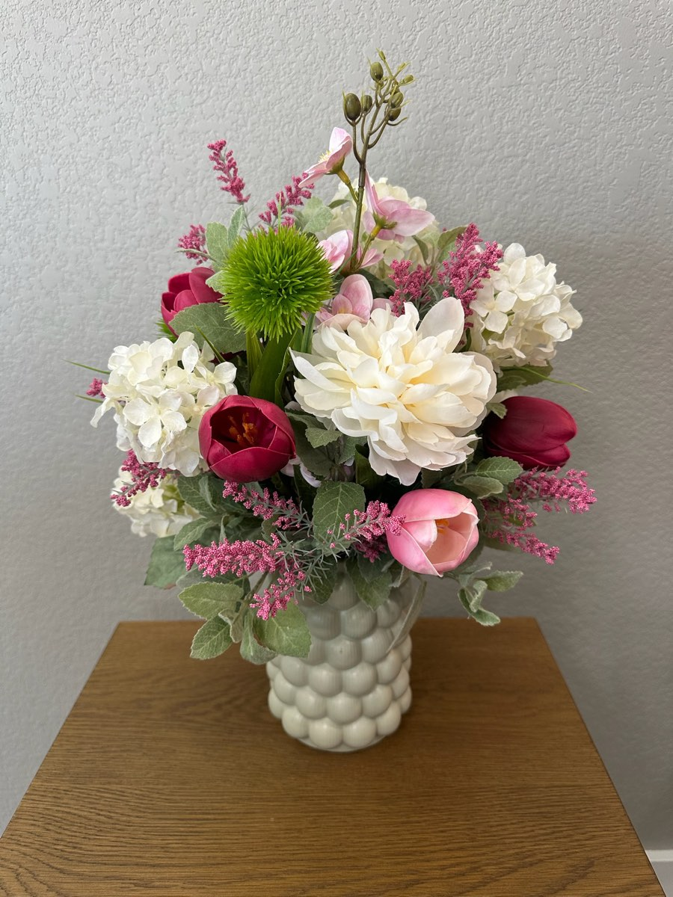

# Schwick's Picks — website

Marketing site for **Schwick's Picks**, a small floral studio specializing in
faux (artificial) flower arrangements, plus fresh florals, wreaths, and custom pieces.

Plain static site: semantic HTML5 + one CSS file + a small vanilla-JS file.
**No build step, no framework, no npm dependencies.** It runs straight from GitHub Pages.

## Pages

| File | Purpose |
|------|---------|
| `index.html` | Home — hero, intro, "what we offer", gallery teaser |
| `services.html` | Faux arrangements (lead), fresh florals, other work |
| `gallery.html` | Grid of past work + Faux / Real / Other filter |
| `quote.html` | Pre-filled mailto quote request + contact details |
| `about.html` | Short "our story" |

Shared header and footer are repeated markup in each file (there is no templating
layer). If you edit the nav or footer, update it in **every** `.html` file.

## Project structure

```
/                         served as the GitHub Pages root
├── index.html services.html gallery.html quote.html about.html
├── styles.css
├── script.js              mobile nav toggle + gallery filter
├── .nojekyll              tells GitHub Pages to serve files as-is
└── assets/img/
    ├── branding/
    │   ├── schwicks-picks-floral.png   watercolor bouquet (hero + footer accent)
    │   ├── sprig.svg                    glyph used in photo placeholders
    │   ├── favicon.png (32px) / favicon-180.png   generated from the bouquet
    └── gallery/            (empty — real photos go here later)
```

## Local preview

No tooling required — open `index.html` in a browser, or serve the folder:

```bash
python3 -m http.server 8000
```

Then visit <http://localhost:8000>.

## Adding real photos later

Placeholders are styled boxes at a fixed **4:5 portrait** ratio so photos drop in
without breaking the grid. Each placeholder has an HTML comment naming the file to add.

1. Save photos into `assets/img/gallery/` using the naming convention:
   `faux-01.jpg`, `faux-02.jpg`, …, `real-01.jpg`, …, `other-01.jpg`, …
2. In the relevant `.photo-ph` block, replace the glyph line
   ```html
   
   <span class="photo-ph__caption">Photo coming soon<br>…</span>
   ```
   with
   ```html
   
   ```

## Quote form

`quote.html` uses a `mailto:` link (pre-filled subject + body), not a submitting form,
because the site has no backend. To upgrade to a hosted form later (e.g. Formspree),
swap the button in the `.quote-card` for a `<form>` — the page styling stays the same.

---

## Deploying to GitHub Pages (now)

The site is served from the **repository root**.

1. Create a repository on GitHub (e.g. `schwicks-picks`) and push this folder to the
   `main` branch:
   ```bash
   git remote add origin https://github.com/<github-username>/schwicks-picks.git
   git push -u origin main
   ```
2. On GitHub: **Settings → Pages**.
3. Under **Build and deployment**, set **Source** to **Deploy from a branch**.
4. Set **Branch** to `main` and folder to **`/ (root)`**. Save.
5. Wait ~1 minute. The site goes live at:
   ```
   https://<github-username>.github.io/schwicks-picks/
   ```

All links and asset paths are **relative**, so the site works unchanged at that URL
and later at the custom domain — nothing to edit when you switch.

---

## Later: connecting schwickspicks.com

Do this once the domain **schwickspicks.com** has been purchased. It's about a
two-minute change plus DNS propagation time.

1. **Add a `CNAME` file** (no file extension) at the published root of the repo,
   containing exactly one line:
   ```
   schwickspicks.com
   ```
   Commit and push it.

2. **At the domain registrar**, add four `A` records on the apex domain
   (`schwickspicks.com`, host `@`) pointing at GitHub Pages:
   ```
   185.199.108.153
   185.199.109.153
   185.199.110.153
   185.199.111.153
   ```

3. **Add a `CNAME` DNS record for `www`** pointing at:
   ```
   <github-username>.github.io
   ```
   so `www.schwickspicks.com` also resolves (this matches the URL on the business card).

4. **In the repo's Settings → Pages**, set **Custom domain** to `schwickspicks.com`
   and save. Once DNS has propagated (can take up to 24 hours), tick
   **Enforce HTTPS**.

## Brand reference

- Name: **Schwick's Picks** (with the apostrophe)
- Email: schwickp@gmail.com
- Phone: (319) 530-7446
- Web: www.schwickspicks.com
- Colors: `--color-bg #F9FFF1`, `--color-primary #72815E`, `--color-accent #A5B88C`, `--color-text #3F4A35`
- Fonts (Google Fonts): Alex Brush (headings/wordmark), Quicksand (UI), Nunito (body)
- Service area: **not yet set** — see the `<!-- TODO: add service area -->` comments near each footer.
